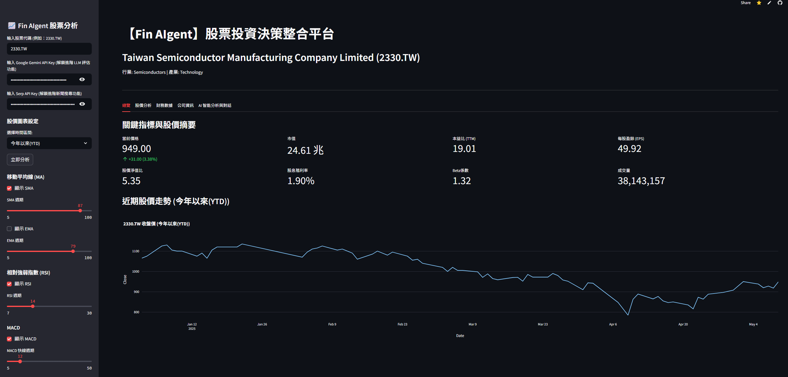

# 📈 Fin AIgent - 股票投資決策整合平台


**Fin AIgent** 是一個基於 Python 和 Streamlit 開發的互動式網頁應用程式，旨在為使用者提供全面、即時的股票市場分析與 AI 驅動的投資洞察。本平台整合了多種數據源和分析工具，協助使用者做出更明智的投資決策。

**[➡️ 點此體驗 Fin AIgent](https://finaigent.streamlit.app/)**

---

## 🌟 主要功能

*   **全面的股票數據**: 獲取即時股價、歷史數據、公司基本資料、財務報表、股息資訊、主要股東及機構持股等。
*   **互動式技術分析**: 提供可自訂參數的 K 線圖，包含多種技術指標如 SMA、EMA、RSI、MACD 及布林帶。
*   **詳細財務報告**: 展示年度損益表、資產負債表、現金流量表，並繪製關鍵財務指標趨勢圖。
*   **公司資訊與新聞**: 提供公司業務摘要、分析師建議，並整合來自 yfinance 及 SerpAPI 的最新相關新聞。
*   **AI 驅動的分析與對話 (整合 Google Gemini)**:
    *   自動生成對選定股票的初始基本面分析報告。
    *   提供互動式聊天機器人，使用者可針對分析報告或股票相關問題進行多輪提問。
*   **外部新聞整合**: 透過 SerpAPI 獲取 Google News 的財經新聞，提供更廣泛的市場視角。
*   **用戶友善介面**: 使用 Streamlit 建構直觀易用的操作介面，包含側邊欄輸入、分頁內容展示等。
*   **數據快取**: 利用 `@st.cache_data` 提升重複查詢的數據載入速度。
*   **時區處理**: 透過 `pytz` 確保股價歷史數據時區的準確性。

---

## 🛠️ 技術架構與平台

本專案採用以下技術與平台建構而成：

1.  **部署與託管 (Deployment & Hosting):**
    *   **程式碼版本控制:** **GitHub** - 專案的原始程式碼存放於 GitHub 進行版本管理。
    *   **應用程式伺服與託管:** **Streamlit 雲端平台 (Streamlit Community Cloud)** - 透過 Streamlit 官方提供的雲端服務進行應用程式的部署與託管，使用者可直接透過網頁瀏覽器存取。

2.  **核心應用程式框架 (Core Application Framework):**
    *   **Streamlit (`streamlit`)**: 主要的 Web 應用程式框架，用於快速建構互動式使用者介面 (UI)，處理使用者輸入、狀態管理 (`st.session_state`)、頁面佈局及數據快取 (`st.cache_data`)。

3.  **數據獲取 (Data Acquisition):**
    *   **yfinance (`yfinance`)**: 從 Yahoo Finance API 獲取股票數據，包括歷史股價、公司資訊、財務報表、新聞等。
    *   **SerpAPI (`google-search-results`)**: 透過 Google News 引擎抓取外部即時財經新聞。

4.  **數據處理與分析 (Data Processing & Analysis):**
    *   **Pandas (`pandas`)**: 用於數據處理、清洗、轉換及分析，將獲取的數據轉換為結構化的 DataFrame。
    *   **TA-Lib (`ta`)**: 技術分析函式庫，用於計算 SMA, EMA, RSI, MACD, Bollinger Bands 等指標。
    *   **Pytz (`pytz`)**: 處理股價歷史數據的時區本地化與轉換。

5.  **數據可視化 (Data Visualization):**
    *   **Plotly (`plotly.express`, `plotly.graph_objects`)**: 創建互動式圖表，如 K 線圖、成交量圖、技術指標圖、財務趨勢圖等。

6.  **人工智能整合 (Artificial Intelligence Integration):**
    *   **Google Generative AI (Gemini API - `google.generativeai`)**: 整合 Google Gemini 模型 (`gemini-1.5-flash-latest`)，用於自動生成基本面分析及提供 AI 互動問答功能。

7.  **其他輔助函式庫:**
    *   **datetime, timedelta (`datetime`)**: 用於日期和時間相關運算。
    *   **os (`os`)**: 基礎作業系統互動 (在此專案中間接用於環境變數管理)。

---

## 🚀 安裝與執行 (本機開發)

若您想在本機端執行或進行二次開發，請依照以下步驟：

1.  **先決條件**:
    *   Python 3.8 或更高版本
    *   Git

2.  **複製專案**:
    ```bash
    git clone https://github.com/Ming874/FinAgent.git
    cd fin-aigent
    ```

3.  **建立並啟用虛擬環境** (建議):
    ```bash
    python -m venv venv
    # Windows
    venv\Scripts\activate
    # macOS/Linux
    source venv/bin/activate
    ```

4.  **安裝依賴套件**:
    ```bash
    pip install -r requirements.txt
    ```

5.  **設定 API 金鑰**:
    參見下一節「🔑 API 金鑰設定」。為了在本機順利執行 AI 分析和外部新聞功能，您需要有效的 API 金鑰。

6.  **執行應用程式**:
    ```bash
    streamlit run stock_app.py
    ```

---

## 🔑 API 金鑰設定

本應用程式使用了以下第三方服務的 API，您需要獲取相應的 API 金鑰才能啟用完整功能：

*   **Google Gemini API Key**: 用於 AI 驅動的分析與聊天功能。
    *   獲取方式：請至 [Google AI Studio](https://aistudio.google.com/app/apikey) 申請。
*   **SerpAPI Key**: 用於獲取外部財經新聞。
    *   獲取方式：請至 [SerpAPI 官方網站](https://serpapi.com/) 註冊並獲取。

**使用方式**:
當您開啟 Fin AIgent 應用程式後，請在左側的側邊欄中找到對應的輸入框，將您的 API 金鑰貼入即可。

*   `輸入 Google Gemini API Key (解鎖進階 LLM 評估功能)`
*   `輸入 Serp API Key (解鎖進階新聞搜尋功能)`

**注意**: 這些金鑰是敏感資訊，請妥善保管，不要直接寫在公開的程式碼中。在 Streamlit Community Cloud 部署時，您可以考慮使用其 Secrets Management 功能來安全地儲存 API 金鑰。

---

## 📖 使用指南

1.  **開啟應用程式**: 透過提供的 Streamlit App 網址或在本機執行後來到應用程式首頁。
2.  **輸入股票代碼**: 在左側邊欄的「輸入股票代碼」欄位中，輸入您想分析的股票代碼 (例如：`2330.TW` 代表台積電，`AAPL` 代表蘋果公司)。
3.  **輸入 API 金鑰 (建議)**: 為了獲得 AI 分析和外部新聞的完整體驗，請在側邊欄輸入您的 Google Gemini API Key 和 SerpAPI Key。
4.  **點擊分析**: 輸入完畢後，點擊側邊欄的「立即分析」按鈕。
5.  **瀏覽分析結果**:
    *   應用程式主區域將會顯示該股票的詳細資訊，並分為多個標籤頁 (Tabs):
        *   **總覽**: 關鍵指標、股價摘要圖。
        *   **股價分析**: K 線圖、成交量圖、可自訂的技術指標 (SMA, EMA, RSI, MACD, 布林帶)。您可以在側邊欄調整技術指標的參數。
        *   **財務數據**: 公司年度損益表、資產負債表、現金流量表趨勢圖，以及關鍵財務比率和股息資訊。
        *   **公司資訊**: 公司業務摘要、主要股東、機構持股、分析師建議評級，以及來自 yfinance 和 SerpAPI 的相關新聞。
        *   **AI 智能分析與對話**:
            *   若已提供 Gemini API Key，此處會自動生成一份基於當前數據的初始股票基本面分析。
            *   您可以在下方的聊天輸入框中，針對此分析或股票的其他問題與 AI (Gemini) 進行互動提問。
6.  **調整圖表設定**:
    *   **時間區間**: 在側邊欄「股價圖表設定」中選擇不同的時間區間 (例如：1個月、1年、YTD) 來更新股價相關圖表的顯示範圍。
    *   **技術指標**: 在側邊欄勾選或調整滑桿來顯示/隱藏不同的技術指標及其參數。

---

## 📝 程式碼結構概覽 (stock_app.py)

以下是 `stock_app.py` 的主要結構與功能模組：

*   **介面配置 (`st.set_page_config`)**: 設定頁面標題、佈局等。
*   **輔助函數**:
    *   `get_stock_data_enhanced(ticker_symbol)`: 封裝了 `yfinance` 的調用，獲取並初步處理股票數據，包含錯誤處理和時區本地化。使用 `@st.cache_data` 進行數據快取。
    *   `get_ai_chat_response_from_gemini(...)`: 調用 Google Gemini API，支援多輪對話歷史。
    *   `get_serpapi_news(...)`: 調用 SerpAPI 獲取新聞。
*   **側邊欄 (`st.sidebar`)**: 處理使用者輸入（股票代碼、API 金鑰、圖表參數）及觸發分析的按鈕。
*   **主內容區**:
    *   **數據加載邏輯**: 判斷是否點擊分析按鈕、股票代碼是否變更，並相應地清除快取、重新獲取數據。使用 `st.session_state` 管理應用程式狀態 (如數據是否已載入、當前股票代碼、聊天歷史等)。
    *   **分頁顯示 (`st.tabs`)**:
        *   **總覽 (Overview Tab)**: 使用 `st.metric` 展示關鍵財務指標，使用 `plotly.express.line` 繪製股價摘要圖。
        *   **股價分析 (Price Analysis Tab)**:
            *   使用 `plotly.graph_objects.Candlestick` 繪製 K 線圖。
            *   整合 `ta` 函式庫計算並繪製 SMA, EMA, Bollinger Bands。
            *   繪製成交量圖、RSI 圖、MACD 圖。
        *   **財務數據 (Financials Tab)**:
            *   使用 `st.dataframe` 展示財務報表 (損益表、資產負債表、現金流量表)。
            *   使用 `plotly.express.line` 或 `plotly.express.bar` 繪製財務數據趨勢圖。
            *   展示關鍵財務比率和股息資訊。
        *   **公司資訊 (Company Profile Tab)**:
            *   展示公司業務摘要、股東資訊。
            *   使用 `plotly.express.pie` 或 `plotly.express.bar` 繪製分析師建議分佈圖。
            *   展示來自 yfinance 和 SerpAPI 的新聞列表。
        *   **AI 智能分析與對話 (AI Chat Tab)**:
            *   根據收集的數據，建構 Prompt 並調用 Gemini API 生成初始分析。
            *   使用 `st.chat_message` 和 `st.chat_input` 實現互動式聊天介面。
*   **錯誤處理與提示**: 在數據獲取失敗或 API 金鑰缺失時，向使用者顯示適當的警告或錯誤訊息 (`st.warning`, `st.error`, `st.info`)。

---

## 🌱 未來展望

*   **更多技術指標**: 增加如 VWAP、Ichimoku Cloud 等進階技術指標。
*   **財報數據季度化**: 提供季度財務數據的選項。
*   **股票篩選器**: 根據財務指標、技術分析等條件篩選股票。
*   **投資組合追蹤**: 允許使用者建立並追蹤自己的投資組合。
*   **使用者個性化設定**: 例如儲存偏好的股票列表、指標設定等。
*   **更深入的 AI 分析**: 結合更多數據源，提供更精準的 AI 預測或風險評估模型。
*   **多語言支援**: 提供英文或其他語言介面。

---

## 🙌 貢獻

歡迎各種形式的貢獻！如果您有任何建議、發現 Bug 或想新增功能，請隨時：

1.  Fork 本專案。
2.  建立您的 Feature Branch (`git checkout -b feature/AmazingFeature`)。
3.  Commit 您的變更 (`git commit -m 'Add some AmazingFeature'`)。
4.  Push 到 Branch (`git push origin feature/AmazingFeature`)。
5.  開啟一個 Pull Request。

---

## 📄 授權

本專案採用 [MIT License](LICENSE.txt) 授權。

---

## 👨‍💻 作者

*   **Tai-Ming Chen**
